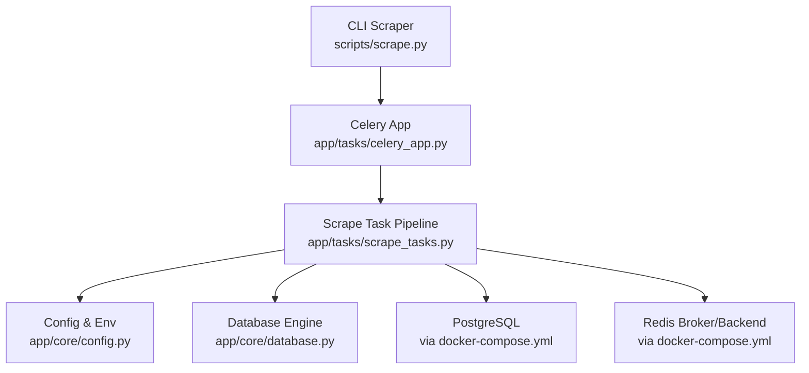
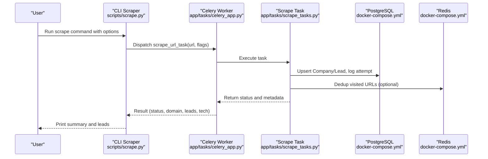
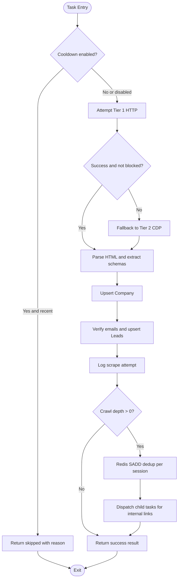
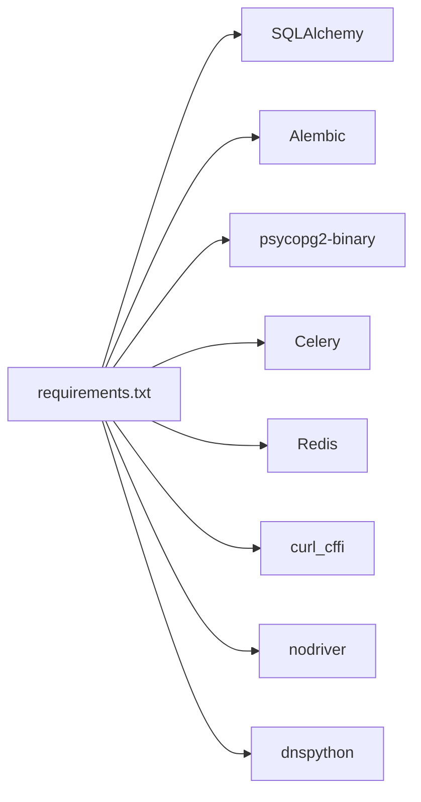

# Getting Started

<cite>
**Referenced Files in This Document**
- [README.md](file://README.md)
- [requirements.txt](file://requirements.txt)
- [docker-compose.yml](file://docker-compose.yml)
- [Dockerfile](file://Dockerfile)
- [scripts/init_db.py](file://scripts/init_db.py)
- [scripts/scrape.py](file://scripts/scrape.py)
- [app/core/config.py](file://app/core/config.py)
- [app/core/database.py](file://app/core/database.py)
- [app/tasks/celery_app.py](file://app/tasks/celery_app.py)
- [app/tasks/scrape_tasks.py](file://app/tasks/scrape_tasks.py)
- [alembic.ini](file://alembic.ini)
</cite>

## Table of Contents
1. Introduction
2. Project Structure
3. Core Components
4. Architecture Overview
5. Detailed Component Analysis
6. Dependency Analysis
7. Performance Considerations
8. Troubleshooting Guide
9. Conclusion
10. Appendices

## Introduction
OmniSpider is a high-performance, multi-tier web scraping and lead generation engine that uses a dual-engine fallback pipeline to bypass advanced protections. It combines fast HTTP fingerprinting with direct Chrome DevTools Protocol (CDP) execution for robust extraction, along with email verification and PostgreSQL persistence.

This guide walks you through environment setup using Python 3.12 virtual environments, dependency installation, configuration via .env, database initialization, Docker deployment, starting Celery workers, and running the CLI scraper for single URL scraping, recursive crawling, and forced tier selection.

## Project Structure
At a high level:
- Configuration and environment variables are loaded from .env into a Pydantic Settings object.
- Database connectivity is configured via SQLAlchemy and initialized using Alembic migrations.
- Celery tasks orchestrate the scraping pipeline, including Tier 1 HTTP and Tier 2 CDP fallbacks.
- The CLI script dispatches jobs to Celery and prints results.

**Diagram sources**
- [scripts/scrape.py:1-132](file://scripts/scrape.py#L1-L132)
- [app/tasks/celery_app.py:1-27](file://app/tasks/celery_app.py#L1-L27)
- [app/tasks/scrape_tasks.py:1-177](file://app/tasks/scrape_tasks.py#L1-L177)
- [app/core/config.py:1-71](file://app/core/config.py#L1-L71)
- [app/core/database.py:1-23](file://app/core/database.py#L1-L23)
- [docker-compose.yml:1-43](file://docker-compose.yml#L1-L43)

**Section sources**
- [README.md:1-118](file://README.md#L1-L118)
- [docker-compose.yml:1-43](file://docker-compose.yml#L1-L43)

## Core Components
- Environment configuration: Pydantic-based settings loaded from .env with defaults and helpers for URLs and lists.
- Database layer: SQLAlchemy engine and session factory; used by repositories and tasks.
- Celery application: Configured with Redis broker/backend and task imports.
- Scraping pipeline: Orchestrates Tier 1 HTTP and Tier 2 CDP fallback, parsing, verification, persistence, logging, and optional recursive crawling.
- CLI interface: Accepts URLs and flags to control behavior (recursive, forced tier, cooldown).

Key responsibilities:
- app/core/config.py: Loads and formats environment variables, provides DATABASE_URL and REDIS_URL_FORMATTED.
- app/core/database.py: Creates SQLAlchemy engine and session factory.
- app/tasks/celery_app.py: Initializes Celery with Redis and imports tasks.
- app/tasks/scrape_tasks.py: Implements the end-to-end scraping pipeline as a Celery task.
- scripts/scrape.py: CLI entrypoint to dispatch scrape jobs and display results.

**Section sources**
- [app/core/config.py:1-71](file://app/core/config.py#L1-L71)
- [app/core/database.py:1-23](file://app/core/database.py#L1-L23)
- [app/tasks/celery_app.py:1-27](file://app/tasks/celery_app.py#L1-L27)
- [app/tasks/scrape_tasks.py:1-177](file://app/tasks/scrape_tasks.py#L1-L177)
- [scripts/scrape.py:1-132](file://scripts/scrape.py#L1-L132)

## Architecture Overview
The system follows a clear separation between the CLI dispatcher, Celery worker processing, and persistent storage.

**Diagram sources**
- [scripts/scrape.py:1-132](file://scripts/scrape.py#L1-L132)
- [app/tasks/celery_app.py:1-27](file://app/tasks/celery_app.py#L1-L27)
- [app/tasks/scrape_tasks.py:1-177](file://app/tasks/scrape_tasks.py#L1-L177)
- [docker-compose.yml:1-43](file://docker-compose.yml#L1-L43)

## Detailed Component Analysis

### Environment Setup and Configuration
- Create and activate a Python 3.12 virtual environment.
- Install dependencies from requirements.txt.
- Configure environment variables in .env (copy from .env.example if available; otherwise set POSTGRES_* and REDIS_URL).
- Ensure REDIS_URL supports SSL when using rediss://; the config module adds ssl_cert_reqs=none automatically.

Steps:
- Create venv with Python 3.12 and install requirements.
- Copy .env.example to .env and fill credentials.
- Verify that DATABASE_URL and REDIS_URL_FORMATTED resolve correctly in code.

**Section sources**
- [README.md:45-77](file://README.md#L45-L77)
- [requirements.txt:1-17](file://requirements.txt#L1-L17)
- [app/core/config.py:36-52](file://app/core/config.py#L36-L52)

### Database Initialization
- Use scripts/init_db.py to create the target database (if missing) and run Alembic migrations to head.
- Alembic configuration points to alembic.ini and the alembic directory.

Steps:
- Ensure PostgreSQL is reachable with the configured credentials.
- Run init_db.py to create the database and apply migrations.

**Section sources**
- [scripts/init_db.py:1-55](file://scripts/init_db.py#L1-L55)
- [alembic.ini:1-38](file://alembic.ini#L1-L38)

### Docker Deployment
- docker-compose.yml defines two services: postgres and celery_worker.
- The Dockerfile installs system dependencies and Google Chrome for Linux, then installs Python dependencies and sets the default CMD to run a Celery worker.

Steps:
- Build and start containers with docker compose up --build -d.
- Confirm PostgreSQL is accessible on port 5432 and the Celery worker is running inside the container.

**Section sources**
- [docker-compose.yml:1-43](file://docker-compose.yml#L1-L43)
- [Dockerfile:1-31](file://Dockerfile#L1-L31)

### Starting Celery Workers
- Start a Celery worker process that loads the Celery app and imports tasks.
- In local development, use a solo pool; in Docker, the worker runs with concurrency based on the Dockerfile CMD.

Commands:
- Local: python -m celery -A app.tasks.celery_app worker --pool=solo -l info
- Docker: Managed by docker-compose service celery_worker

**Section sources**
- [README.md:92-95](file://README.md#L92-L95)
- [app/tasks/celery_app.py:1-27](file://app/tasks/celery_app.py#L1-L27)
- [Dockerfile:29-31](file://Dockerfile#L29-L31)

### Running the CLI Scraper
The CLI accepts one or more URLs and supports flags for recursion, forced tier, and cooldown.

Usage patterns:
- Single URL scraping: python scripts/scrape.py https://example.com
- Recursive crawling: python scripts/scrape.py https://example.com --recursive
- Force Tier 2 (CDP): python scripts/scrape.py https://nowsecure.nl --tier2
- Cooldown check: add -c/--cooldown to enable 7-day frequency control

Behavior highlights:
- Normalizes URLs without scheme to https.
- Dispatches tasks to Celery and waits for results.
- Prints extracted company name, leads saved, detected technologies, and any dispatched subpages.

**Section sources**
- [scripts/scrape.py:104-131](file://scripts/scrape.py#L104-L131)
- [README.md:99-112](file://README.md#L99-L112)

### Celery Task Pipeline Flow
The task orchestrates:
- Optional cooldown check against recent scrape logs.
- Tier 1 HTTP fetch; fallback to Tier 2 CDP if blocked or failed.
- HTML parsing and technographic extraction.
- Email verification and lead persistence.
- Logging scrape attempts.
- Optional recursive subpage crawling with Redis-based deduplication per session.

**Diagram sources**
- [app/tasks/scrape_tasks.py:29-177](file://app/tasks/scrape_tasks.py#L29-L177)

## Dependency Analysis
Core runtime dependencies include SQLAlchemy, Alembic, psycopg2-binary, Celery, Redis, curl_cffi, nodriver, dnspython, and others listed in requirements.txt.

**Diagram sources**
- [requirements.txt:1-17](file://requirements.txt#L1-L17)

**Section sources**
- [requirements.txt:1-17](file://requirements.txt#L1-L17)

## Performance Considerations
- Prefer Tier 1 HTTP for speed; fall back to Tier 2 CDP only when necessary.
- Use cooldown checks to avoid redundant scraping within the configured window.
- Limit recursive crawl depth and maximum links per page to control workload.
- Ensure Redis and PostgreSQL are properly sized and networked for your scale.

[No sources needed since this section provides general guidance]

## Troubleshooting Guide
Common issues and resolutions:
- Celery worker not found or tasks not executing:
  - Ensure the worker is started with the correct Celery app path and imports.
  - Verify Redis connectivity and credentials.
- Database connection errors:
  - Confirm PostgreSQL host, port, user, password, and database name match .env settings.
  - Run scripts/init_db.py to ensure the database exists and migrations are applied.
- SSL/TLS issues with Redis:
  - If using rediss://, the config module appends ssl_cert_reqs=none automatically; verify the final REDIS_URL_FORMATTED.
- Blocked pages and timeouts:
  - Use --tier2 to force CDP fallback for protected targets.
  - Adjust cooldown and max links settings as needed.

Verification steps:
- Start the Celery worker and confirm it imports tasks successfully.
- Run a simple scrape command and check the printed result for status, domain, and leads saved.
- Query PostgreSQL to confirm companies and leads were persisted.

**Section sources**
- [app/tasks/celery_app.py:1-27](file://app/tasks/celery_app.py#L1-L27)
- [scripts/init_db.py:1-55](file://scripts/init_db.py#L1-L55)
- [app/core/config.py:42-52](file://app/core/config.py#L42-L52)
- [scripts/scrape.py:104-131](file://scripts/scrape.py#L104-L131)

## Conclusion
You now have the essential steps to set up OmniSpider locally or via Docker, initialize the database, start Celery workers, and run the CLI scraper with various modes. For production, ensure secure credential management, proper scaling of Celery workers, and monitoring of Redis and PostgreSQL.

[No sources needed since this section summarizes without analyzing specific files]

## Appendices

### Quickstart Commands Summary
- Create and activate Python 3.12 venv and install dependencies.
- Copy .env.example to .env and configure credentials.
- Initialize database and migrations.
- Start Celery worker.
- Run CLI scraper with desired flags.

**Section sources**
- [README.md:45-112](file://README.md#L45-L112)