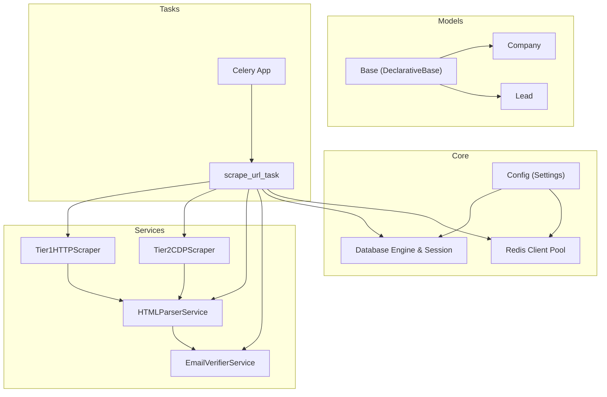
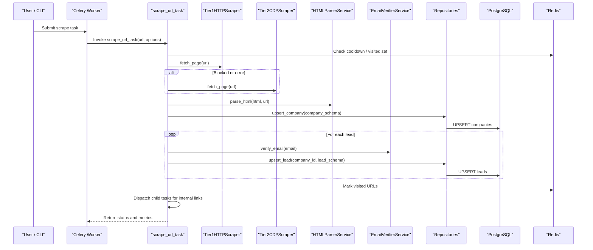
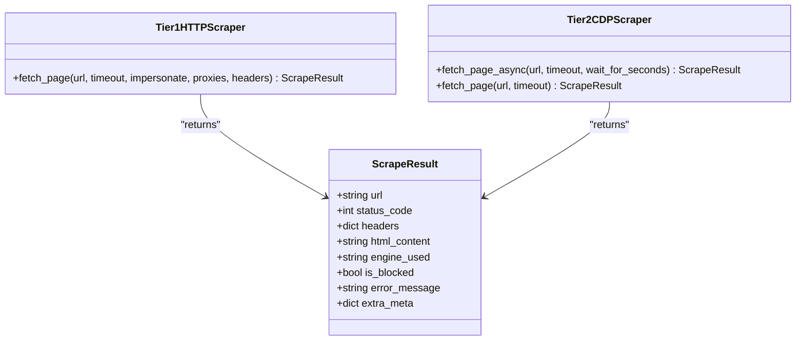
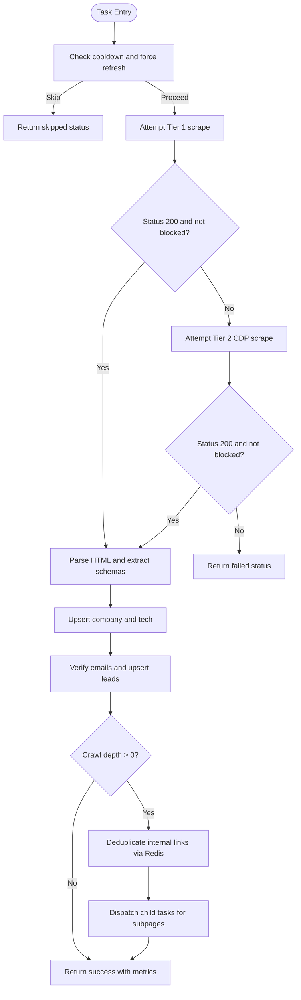
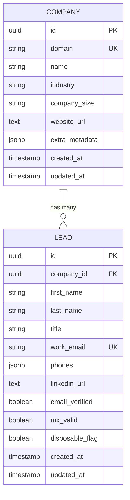
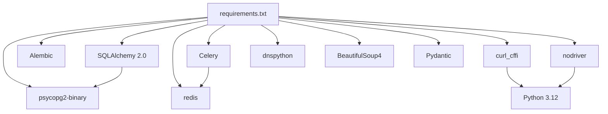

# Project Overview

<cite>
**Referenced Files in This Document**
- [README.md](file://README.md)
- [requirements.txt](file://requirements.txt)
- [app/core/config.py](file://app/core/config.py)
- [app/core/database.py](file://app/core/database.py)
- [app/core/redis.py](file://app/core/redis.py)
- [alembic.ini](file://alembic.ini)
- [app/models/base.py](file://app/models/base.py)
- [app/models/company.py](file://app/models/company.py)
- [app/models/lead.py](file://app/models/lead.py)
- [app/services/scrapers/base.py](file://app/services/scrapers/base.py)
- [app/services/scrapers/tier1_http.py](file://app/services/scrapers/tier1_http.py)
- [app/services/scrapers/tier2_cdp.py](file://app/services/scrapers/tier2_cdp.py)
- [app/tasks/celery_app.py](file://app/tasks/celery_app.py)
- [app/tasks/scrape_tasks.py](file://app/tasks/scrape_tasks.py)
</cite>

## Table of Contents
1. Introduction
2. Project Structure
3. Core Components
4. Architecture Overview
5. Detailed Component Analysis
6. Dependency Analysis
7. Performance Considerations
8. Troubleshooting Guide
9. Conclusion

## Introduction
OmniSpider is an enterprise-grade B2B web scraping and lead generation engine designed to bypass advanced Web Application Firewalls (Cloudflare Turnstile, Incapsula, Akamai). It uses a dual-engine approach: a high-speed HTTP layer with TLS fingerprint spoofing and a Chrome DevTools Protocol (CDP) automation fallback that executes JavaScript SPAs without detectable automation flags. The system includes email verification, recursive crawling, and robust PostgreSQL persistence with upsert semantics for deduplication.

Key capabilities include:
- Dual-engine stealth pipeline: Tier 1 curl_cffi with TLS/JA3/JA4 spoofing; Tier 2 nodriver CDP for WAF-resistant rendering.
- Email verification with RFC checks, disposable domain filtering, and MX record validation.
- Recursive subpage crawling with session-based deduplication via Redis.
- Thread-safe PostgreSQL persistence using SQLAlchemy 2.0 ORM and Alembic migrations.

Technology stack:
- Python 3.12, Celery, Redis (including Upstash), PostgreSQL 16, SQLAlchemy 2.0, Alembic, curl_cffi, nodriver, dnspython, Pydantic, BeautifulSoup.

Practical examples:
- Scrape a single site: run the CLI scraper against a target URL.
- Recursive crawl: enable recursion to discover internal links and dispatch child tasks.
- Force Tier 2: use the CDP engine directly for Cloudflare-protected targets.

Conceptual overview for beginners:
- OmniSpider fetches web pages, extracts company and contact data, verifies emails, stores results, and can follow internal links to gather more information across a domain.

Technical overview for experienced developers:
- A Celery task orchestrates a resilient scrape pipeline with automatic fallback, parsing, verification, persistence, and recursive crawling with deduplication.

**Section sources**
- [README.md:1-118](file://README.md#L1-L118)

## Project Structure
The repository follows a modular layout separating configuration, models, repositories, services, and tasks:
- app/core: Configuration, database sessions, and Redis client initialization.
- app/models: SQLAlchemy 2.0 ORM definitions for Company, Lead, and related entities.
- app/repositories: Data access layer implementing UPSERT operations and frequency control.
- app/services/scrapers: Scraping engines (Tier 1 HTTP, Tier 2 CDP), HTML parser, and email verifier.
- app/tasks: Celery application and background tasks implementing the end-to-end pipeline.
- alembic: Database migration scripts and configuration.
- config: JSON profiles for directory domains, field mappings, and technology signatures.
- scripts: CLI tools and test harnesses for scraping, verification, and end-to-end flows.

**Diagram sources**
- [app/core/config.py:1-71](file://app/core/config.py#L1-L71)
- [app/core/database.py:1-23](file://app/core/database.py#L1-L23)
- [app/core/redis.py:1-21](file://app/core/redis.py#L1-L21)
- [app/models/base.py:1-5](file://app/models/base.py#L1-L5)
- [app/models/company.py:1-24](file://app/models/company.py#L1-L24)
- [app/models/lead.py:1-27](file://app/models/lead.py#L1-L27)
- [app/services/scrapers/tier1_http.py:1-97](file://app/services/scrapers/tier1_http.py#L1-L97)
- [app/services/scrapers/tier2_cdp.py:1-110](file://app/services/scrapers/tier2_cdp.py#L1-L110)
- [app/tasks/celery_app.py:1-27](file://app/tasks/celery_app.py#L1-L27)
- [app/tasks/scrape_tasks.py:1-177](file://app/tasks/scrape_tasks.py#L1-L177)

**Section sources**
- [README.md:25-41](file://README.md#L25-L41)
- [alembic.ini:1-38](file://alembic.ini#L1-L38)

## Core Components
- Configuration: Centralized settings loaded from environment variables, including database URLs, Redis connection, scrape cooldowns, blocklists, ignored query parameters, DNS servers, and browser fingerprint profiles.
- Database: SQLAlchemy engine and session factory configured with connection pooling and pre-ping health checks.
- Redis: Connection-pooled client with SSL support and timeouts for task queue and deduplication sets.
- Models: ORM entities for Company and Lead with UUID primary keys, timestamps, and JSONB fields for flexible metadata and phone structures.
- Scrapers: 
  - Tier 1 HTTP: curl_cffi with TLS impersonation and WAF challenge detection heuristics.
  - Tier 2 CDP: nodriver CDP for headless Chrome execution, adaptive readyState polling, and WAF challenge detection.
- Tasks: Celery task orchestrating the full pipeline with progress updates, fallback logic, parsing, verification, persistence, and recursive crawling.

**Section sources**
- [app/core/config.py:1-71](file://app/core/config.py#L1-L71)
- [app/core/database.py:1-23](file://app/core/database.py#L1-L23)
- [app/core/redis.py:1-21](file://app/core/redis.py#L1-L21)
- [app/models/company.py:1-24](file://app/models/company.py#L1-L24)
- [app/models/lead.py:1-27](file://app/models/lead.py#L1-L27)
- [app/services/scrapers/tier1_http.py:1-97](file://app/services/scrapers/tier1_http.py#L1-L97)
- [app/services/scrapers/tier2_cdp.py:1-110](file://app/services/scrapers/tier2_cdp.py#L1-L110)
- [app/tasks/scrape_tasks.py:1-177](file://app/tasks/scrape_tasks.py#L1-L177)

## Architecture Overview
OmniSpider’s architecture centers on a Celery-driven pipeline that coordinates scraping, parsing, verification, persistence, and recursive crawling. The dual-engine approach ensures resilience against WAFs by falling back from fast HTTP requests to headless browser automation when needed.

**Diagram sources**
- [app/tasks/celery_app.py:1-27](file://app/tasks/celery_app.py#L1-L27)
- [app/tasks/scrape_tasks.py:1-177](file://app/tasks/scrape_tasks.py#L1-L177)
- [app/services/scrapers/tier1_http.py:1-97](file://app/services/scrapers/tier1_http.py#L1-L97)
- [app/services/scrapers/tier2_cdp.py:1-110](file://app/services/scrapers/tier2_cdp.py#L1-L110)
- [app/core/redis.py:1-21](file://app/core/redis.py#L1-L21)
- [app/core/database.py:1-23](file://app/core/database.py#L1-L23)

## Detailed Component Analysis

### Dual-Engine Scrapers
- Tier 1 HTTP Scraper: Uses curl_cffi to spoof TLS fingerprints (JA3/JA4) and rotates browser profiles from configuration. Implements content-based WAF challenge detection heuristics and returns standardized ScrapeResult objects.
- Tier 2 CDP Scraper: Uses nodriver to launch headless Chrome via WebSocket CDP, adapts wait strategies based on document readiness, and detects unresolved WAF challenges. Provides both async and sync interfaces for Celery compatibility.

**Diagram sources**
- [app/services/scrapers/base.py:1-15](file://app/services/scrapers/base.py#L1-L15)
- [app/services/scrapers/tier1_http.py:1-97](file://app/services/scrapers/tier1_http.py#L1-L97)
- [app/services/scrapers/tier2_cdp.py:1-110](file://app/services/scrapers/tier2_cdp.py#L1-L110)

**Section sources**
- [app/services/scrapers/tier1_http.py:1-97](file://app/services/scrapers/tier1_http.py#L1-L97)
- [app/services/scrapers/tier2_cdp.py:1-110](file://app/services/scrapers/tier2_cdp.py#L1-L110)

### Celery Pipeline Orchestration
The main task implements the end-to-end flow: optional cooldown check, Tier 1 attempt, Tier 2 fallback, parsing, email verification, persistence, and recursive crawling with Redis-based deduplication. Progress updates are emitted via Celery state tracking.

**Diagram sources**
- [app/tasks/scrape_tasks.py:1-177](file://app/tasks/scrape_tasks.py#L1-L177)
- [app/core/redis.py:1-21](file://app/core/redis.py#L1-L21)

**Section sources**
- [app/tasks/scrape_tasks.py:1-177](file://app/tasks/scrape_tasks.py#L1-L177)

### Data Models and Persistence
- Base model defines the declarative base for SQLAlchemy 2.0.
- Company model includes domain uniqueness, industry, size, website URL, and JSONB metadata, with relationships to Leads and Technologies.
- Lead model captures personal details, work email, phones (JSONB), LinkedIn URL, and verification flags, with a foreign key relationship to Company.

**Diagram sources**
- [app/models/base.py:1-5](file://app/models/base.py#L1-L5)
- [app/models/company.py:1-24](file://app/models/company.py#L1-L24)
- [app/models/lead.py:1-27](file://app/models/lead.py#L1-L27)

**Section sources**
- [app/models/company.py:1-24](file://app/models/company.py#L1-L24)
- [app/models/lead.py:1-27](file://app/models/lead.py#L1-L27)

### Configuration and Infrastructure
- Settings encapsulate database credentials, Redis URL, scrape cooldown days, max links per page, directory domains, blocklist patterns, ignored query parameters, DNS servers, and browser profiles.
- Database engine and session factory provide thread-safe connections with pre-ping health checks.
- Redis client initializes a shared connection pool with SSL support and timeouts.
- Celery app configures broker/backend URLs, serializers, timezone, SSL options, and imports tasks.

**Section sources**
- [app/core/config.py:1-71](file://app/core/config.py#L1-L71)
- [app/core/database.py:1-23](file://app/core/database.py#L1-L23)
- [app/core/redis.py:1-21](file://app/core/redis.py#L1-L21)
- [app/tasks/celery_app.py:1-27](file://app/tasks/celery_app.py#L1-L27)

## Dependency Analysis
OmniSpider depends on a well-defined set of libraries for networking, browser automation, parsing, verification, and persistence. The dependency graph highlights how core modules interact through these libraries.

**Diagram sources**
- [requirements.txt:1-17](file://requirements.txt#L1-L17)

**Section sources**
- [requirements.txt:1-17](file://requirements.txt#L1-L17)

## Performance Considerations
- Tier 1 HTTP scraping minimizes latency with TLS fingerprint spoofing and avoids browser overhead.
- Tier 2 CDP scraping is heavier but necessary for JS-heavy or WAF-protected sites; adaptive polling reduces unnecessary waits.
- Redis-based deduplication prevents redundant processing within a session and limits network calls.
- PostgreSQL UPSERT operations ensure efficient writes and avoid duplicates.
- Connection pooling and pre-ping checks improve reliability under load.

[No sources needed since this section provides general guidance]

## Troubleshooting Guide
Common issues and resolutions:
- WAF challenges detected: Ensure Tier 2 fallback is enabled or force tier 2 for protected targets. Review WAF signature heuristics and adjust if needed.
- Celery worker connectivity: Validate Redis URL and SSL settings; confirm broker/backend configurations match environment variables.
- Database connectivity: Check PostgreSQL credentials and network reachability; verify Alembic migrations have been applied.
- Email verification failures: Confirm DNS server configuration and MX resolution; review disposable domain filters.

**Section sources**
- [app/services/scrapers/tier1_http.py:55-76](file://app/services/scrapers/tier1_http.py#L55-L76)
- [app/services/scrapers/tier2_cdp.py:63-70](file://app/services/scrapers/tier2_cdp.py#L63-L70)
- [app/tasks/celery_app.py:11-21](file://app/tasks/celery_app.py#L11-L21)
- [app/core/config.py:30-35](file://app/core/config.py#L30-L35)

## Conclusion
OmniSpider delivers a robust, scalable solution for B2B lead generation by combining high-performance HTTP scraping with resilient browser automation. Its dual-engine design, comprehensive verification, and reliable persistence make it suitable for modern web scraping workflows where WAFs and dynamic content are common. By leveraging Celery, Redis, and PostgreSQL, it achieves parallelism, deduplication, and durability at scale.

[No sources needed since this section summarizes without analyzing specific files]