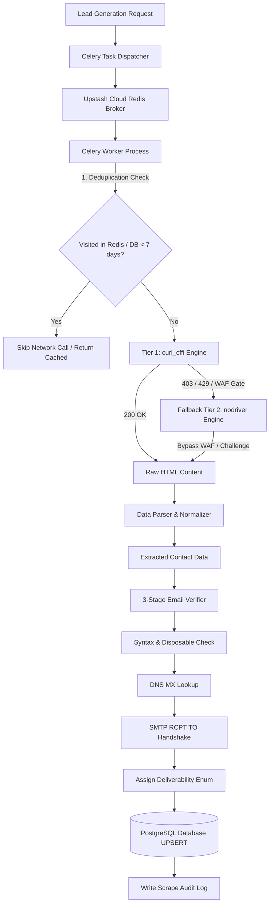

# System Architecture & Technical Specification Document

**Project Name:** OmniSpider — Unblockable Multi-Tier Web Scraper & B2B Lead Generation Engine

**Document Type:** Comprehensive System Reference Specification

**Version:** 2.0.0

**Target Environment:** Windows OS / POSIX Compatible Python 3.10+ Runtime

---

## 1. System Overview & Dual-Tier Engine Architecture

OmniSpider is an enterprise-grade web scraping, contact extraction, and lead verification platform designed to bypass Web Application Firewall (WAF) protections (Cloudflare Turnstile, DataDome, Akamai) while extracting firmographics, decision-maker profiles, phone numbers, and verified work emails.

```
┌──────────────────────────────────────────────────────────────────────────────────┐
│                            DUAL-TIER ENGINE DESIGN                               │
├───────────────────┬──────────────────────────────────┬───────────────────────────┤
│ Metric / Layer    │ Tier 1 Engine (curl_cffi)        │ Tier 2 Engine (nodriver)  │
├───────────────────┼──────────────────────────────────┼───────────────────────────┤
│ Execution Style   │ High-speed HTTP Async Session    │ Direct CDP WebSockets     │
│ Execution Speed   │ ≤ 1.5s per page                  │ ≤ 8.0s per page           │
│ Browser Overhead  │ Zero browser memory footprint    │ Headless Chromium instance│
│ Fingerprint Spoof │ Chrome JA4/JA3 TLS Handshakes    │ Native Chrome Protocol    │
│ WAF Capability    │ Standard Cloudflare & Akamai     │ Cloudflare Turnstile      │
│ Asset Filtering   │ Skips static downloads           │ Request interception      │
└───────────────────┴──────────────────────────────────┴───────────────────────────┘

```



---

## 2. Technology Stack Specification

* **Core Programming Language:** Python 3.10+
* **Asynchronous Task Processing:** Celery with Upstash Cloud Redis (`rediss://` TLS endpoint)
* **Windows Execution Rule:** Celery must run using the solo pool execution model (`celery -A tasks worker -P solo`) to avoid POSIX process-forking crashes on Microsoft Windows.
* **Database Engine:** PostgreSQL 15+ (`lead_gen_db`) managed via SQLAlchemy 2.0 ORM and Alembic migrations.
* **FastAPI Application Server:** REST endpoints for task creation, search, and metrics monitoring.
* **Tier 1 Scraper:** `curl_cffi` (targeting Chrome TLS JA4 signatures).
* **Tier 2 Scraper:** `nodriver` (direct Chromium WebSocket CDP control without Playwright/Selenium automation flags).
* **Verification & Parsing:** `BeautifulSoup4`, `lxml`, `dnspython`, `aiosmtplib`, `phonenumbers`, `nameparser`.

---

## 3. PostgreSQL Database Schema (DDL)

```sql
-- PostgreSQL Database Schema Initialization

CREATE TYPE email_status_enum AS ENUM ('verified', 'catch_all', 'unverified', 'invalid', 'disposable');
CREATE TYPE seniority_enum AS ENUM ('c_level', 'vp', 'director', 'manager', 'individual_contributor');

-- 1. Companies Table
CREATE TABLE IF NOT EXISTS companies (
    id UUID PRIMARY KEY DEFAULT gen_random_uuid(),
    domain VARCHAR(255) UNIQUE NOT NULL,
    name VARCHAR(255) NOT NULL,
    industry VARCHAR(100),
    employee_count_range VARCHAR(50),
    headquarters_city VARCHAR(100),
    headquarters_country VARCHAR(100),
    hq_phone VARCHAR(50),
    linkedin_url VARCHAR(500),
    twitter_url VARCHAR(500),
    funding_stage VARCHAR(50),
    created_at TIMESTAMP WITH TIME ZONE DEFAULT CURRENT_TIMESTAMP,
    updated_at TIMESTAMP WITH TIME ZONE DEFAULT CURRENT_TIMESTAMP
);

-- 2. Leads Table
CREATE TABLE IF NOT EXISTS leads (
    id UUID PRIMARY KEY DEFAULT gen_random_uuid(),
    company_id UUID REFERENCES companies(id) ON DELETE SET NULL,
    company_domain VARCHAR(255) NOT NULL,
    first_name VARCHAR(100) NOT NULL,
    last_name VARCHAR(100) NOT NULL,
    full_name VARCHAR(200) NOT NULL,
    job_title VARCHAR(200) NOT NULL,
    seniority seniority_enum,
    department VARCHAR(100),
    work_email VARCHAR(255),
    email_status email_status_enum DEFAULT 'unverified',
    email_verified_at TIMESTAMP WITH TIME ZONE,
    phone_numbers JSONB DEFAULT '[]'::jsonb, -- Format: [{"number": "+14155550199", "type": "mobile"}]
    linkedin_url VARCHAR(500),
    source_platform VARCHAR(100) NOT NULL,
    created_at TIMESTAMP WITH TIME ZONE DEFAULT CURRENT_TIMESTAMP,
    updated_at TIMESTAMP WITH TIME ZONE DEFAULT CURRENT_TIMESTAMP
);

-- 3. Technographics Table
CREATE TABLE IF NOT EXISTS company_technologies (
    id UUID PRIMARY KEY DEFAULT gen_random_uuid(),
    company_id UUID REFERENCES companies(id) ON DELETE CASCADE,
    tech_name VARCHAR(100) NOT NULL,
    category VARCHAR(100),
    detected_at TIMESTAMP WITH TIME ZONE DEFAULT CURRENT_TIMESTAMP,
    UNIQUE(company_id, tech_name)
);

-- 4. Scraping Audit Logs Table
CREATE TABLE IF NOT EXISTS scrape_logs (
    id UUID PRIMARY KEY DEFAULT gen_random_uuid(),
    target_url TEXT NOT NULL,
    domain VARCHAR(255) NOT NULL,
    engine_used VARCHAR(50) NOT NULL, -- 'curl_cffi' or 'nodriver'
    status_code INT,
    status VARCHAR(50) NOT NULL,      -- 'success', 'blocked', 'failed'
    error_message TEXT,
    scraped_at TIMESTAMP WITH TIME ZONE DEFAULT CURRENT_TIMESTAMP
);

-- 5. Account Pool Management Table
CREATE TABLE IF NOT EXISTS account_pool (
    id UUID PRIMARY KEY DEFAULT gen_random_uuid(),
    platform VARCHAR(50) NOT NULL,
    username VARCHAR(255) NOT NULL,
    profile_dir_path VARCHAR(500),
    status VARCHAR(50) DEFAULT 'active',
    daily_request_count INT DEFAULT 0,
    last_used_at TIMESTAMP WITH TIME ZONE,
    created_at TIMESTAMP WITH TIME ZONE DEFAULT CURRENT_TIMESTAMP
);

-- Performance Indexes
CREATE INDEX IF NOT EXISTS idx_leads_work_email ON leads(work_email);
CREATE INDEX IF NOT EXISTS idx_leads_company_domain ON leads(company_domain);
CREATE INDEX IF NOT EXISTS idx_scrape_logs_domain ON scrape_logs(domain);
CREATE INDEX IF NOT EXISTS idx_scrape_logs_scraped_at ON scrape_logs(scraped_at);

```

---

## 4. Multi-Stage Email & Data Verification Engine

The email verification subsystem processes extracted contacts through a non-sending multi-step pipeline:

1. **RFC 5322 Syntax Checking:** Enforces valid email formats via compiled regular expressions.
2. **Disposable Domain Filtering:** Rejects emails matching an internal database of 3,000+ temporary email providers (`mailinator.com`, `tempmail.com`, etc.).
3. **Async DNS MX Record Lookup:** Uses `dnspython` to query primary and secondary Mail Exchange (`MX`) hosts for the domain.
4. **Non-Sending SMTP Handshake (`aiosmtplib`):**
* Connects to the MX host on port 25 with a 5-second socket timeout.
* Transmits `HELO / EHLO mail.yourdomain.com`.
* Issues `MAIL FROM:<verify@yourdomain.com>`.
* Issues `RCPT TO:<lead_work_email>`.
* Maps server response code to deliverability status:
* `250 OK` $\rightarrow$ `verified`
* `550 User Unknown` $\rightarrow$ `invalid`
* Accepts all dummy addresses $\rightarrow$ `catch_all`


5. **Data Standardization:**
* **Phone Numbers:** Formatted to international E.164 standards via `phonenumbers`.
* **Names:** Parsed into `first_name`, `last_name`, and prefix using `nameparser`.
* **Domains:** Normalized by stripping subdomains and protocol prefixes.


---

## 5. Master Work Breakdown Structure (WBS Phase 1 – Phase 7)

```
├── Phase 1: Core Engine Stability & Safety Guardrails
│   ├── WBS 1.1: Global URL Deduplication Module (Redis SET visited_urls:<domain>)
│   ├── WBS 1.2: Worker Process Scraper Scoping Module (nodriver task-level scoping)
│   ├── WBS 1.3: Relational Persistence Conflict Handling (ON CONFLICT DO NOTHING)
│   ├── WBS 1.4: Crawl Filter & URL Blocklist Module (/cdn-cgi/, /wp-json/, assets)
│   └── WBS 1.5: Incremental Scrape Cooldown Enforcement (7-day database guard)
├── Phase 2: Advanced Network & Resiliency Architecture
│   ├── WBS 2.1: Multi-Tier Smart Proxy Router (Datacenter -> Residential switching)
│   ├── WBS 2.2: Automated Proxy Ban & Cooldown Detector
│   ├── WBS 2.3: CAPTCHA Solver Fallback Subsystem (CapSolver / 2Captcha integration)
│   └── WBS 2.4: Per-Domain Rate Limiting Subsystem (Redis Token Bucket)
├── Phase 3: Contact Verification & Data Enrichment Subsystems
│   ├── WBS 3.1: Multi-Stage Email Verification Engine (aiosmtplib RCPT TO)
│   ├── WBS 3.2: Browser Asset & Bandwidth Optimization Engine (nodriver asset block)
│   ├── WBS 3.3: Phone Number Standardization Subsystem (E.164 format parsing)
│   ├── WBS 3.4: Person Name Parsing & Decomposition Module
│   └── WBS 3.5: Domain Canonicalization & Redirect Handler
├── Phase 4: Authenticated Session & Account Pool Management
│   ├── WBS 4.1: Account Pool State & Profile Persistence Manager
│   ├── WBS 4.2: Cookie Injection & Session Warmup Subsystem
│   └── WBS 4.3: Account Throttling & Suspension Prevention Module
├── Phase 5: FastAPI Backend Application Server
│   ├── WBS 5.1: API Framework Architecture & OpenAPI Specification
│   ├── WBS 5.2: Authentication & Authorization Guard (API Key / JWT)
│   ├── WBS 5.3: Scrape Job Management & Dispatch Controller
│   ├── WBS 5.4: Leads & Companies Search API
│   ├── WBS 5.5: Standalone Contact Verification Endpoint
│   └── WBS 5.6: System Health & Telemetry Metrics Endpoint
├── Phase 6: Frontend User Interface Dashboard
│   ├── WBS 6.1: Web Dashboard Application Shell
│   ├── WBS 6.2: Scraper Job Dispatch & Command Panel
│   ├── WBS 6.3: Real-Time Job Progress & Worker Activity Monitor
│   ├── WBS 6.4: Lead Management & Inspection Data Table
│   ├── WBS 6.5: Export Engine Subsystem (CSV / JSON export)
│   └── WBS 6.6: Telemetry & Performance Analytics View
└── Phase 7: End-to-End System Verification & Deployment
    ├── WBS 7.1: Layer 1 – API Payload & Schema Verification Gate
    ├── WBS 7.2: Layer 2 – WAF & Network Bypass Verification Gate
    ├── WBS 7.3: Layer 3 – Contact Deliverability Verification Gate
    ├── WBS 7.4: Layer 4 – Data Storage & Relational Integrity Gate
    └── WBS 7.5: Container Orchestration & Deployment Subsystem (Docker Compose)

```

---

## 6. 4-Layer System Verification Matrix

```
┌────────────────────────────────────────────────────────────────────────┐
│                      4-LAYER VERIFICATION MATRIX                       │
├─────────┬────────────────────────────┬─────────────────────────────────┤
│ Layer   │ Verification Focus         │ Operational Validation Target   │
├─────────┼────────────────────────────┼─────────────────────────────────┤
│ Layer 1 │ API Payload & Input Gate   │ Validates Pydantic schemas, URL │
│         │                            │ structure, and auth tokens.     │
│ Layer 2 │ WAF & Network Bypass Gate  │ Validates HTTP status 200 and   │
│         │                            │ presence of valid DOM elements. │
│ Layer 3 │ Contact Deliverability Gate│ Executes Regex -> MX -> SMTP    │
│         │                            │ deliverability evaluation.      │
│ Layer 4 │ Data Storage Integrity Gate│ Enforces PostgreSQL UPSERTs and │
│         │                            │ canonical domain dedup rules.   │
└─────────┴────────────────────────────┴─────────────────────────────────┘

```
